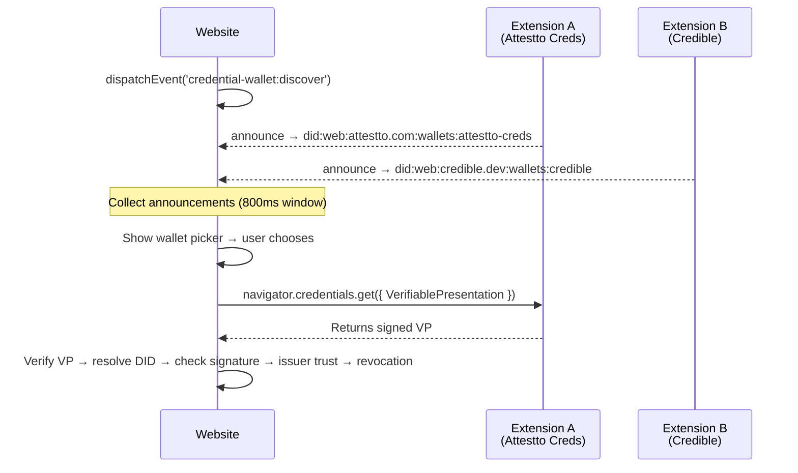

# identity-bridge

Universal discovery protocol for credential wallet browser extensions — like [EIP-6963](https://eips.ethereum.org/EIPS/eip-6963) but for W3C identity wallets.

Sites broadcast a discovery event, installed wallet extensions announce themselves with their DID identity and metadata. Multiple wallets can coexist — the user always chooses.

## Identity Middleware — not a wallet connector

WalletConnect, Dynamic, and Wagmi are **crypto wallet connectors**. They connect MetaMask, Phantom, and Ledger to dApps for **transaction signing** — send ETH, swap tokens, call contracts. They prove "this person controls this private key." That's where they stop.

This package is the **credential exchange layer that comes after**. It connects **credential wallets** — Attestto Creds, Credible, Trinsic — to sites for **Verifiable Presentations**. It proves "a trusted issuer attested this about you" with field-level selective disclosure and cryptographic verification.

### Why this matters

A crypto wallet connector tells you someone owns address `0xabc...`. It cannot tell you that person passed KYC, holds a vLEI credential from GLEIF, or has a verified institutional identity. For any regulated use case — FATF Travel Rule, eIDAS 2.0, AML compliance — you need the identity layer, not just the key.

<table>
<tr>
<td width="60" align="center"><strong>Step</strong></td>
<td width="280"><strong>Layer</strong></td>
<td width="60" align="center"><strong>Role</strong></td>
<td><strong>Output</strong></td>
</tr>
<tr>
<td align="center">1</td>
<td>WalletConnect / Phantom</td>
<td align="center">🔌</td>
<td>Address + signer</td>
</tr>
<tr>
<td align="center">2</td>
<td><a href="https://github.com/Attestto-com/identity-resolver">identity-resolver</a></td>
<td align="center">🔍</td>
<td>DIDs, KYC status, vLEI, SBTs, domains</td>
</tr>
<tr>
<td align="center">3</td>
<td><strong>identity-bridge</strong></td>
<td align="center">🛡️</td>
<td>VP request + cryptographic verification</td>
</tr>
<tr>
<td colspan="4" align="center"><em>Existing connectors handle step 1. Steps 2–3 are the identity middleware that crypto wallets are missing.</em></td>
</tr>
</table>

### What you get vs. what exists

<table>
<tr>
<th width="160"></th>
<th width="320">WalletConnect / Dynamic / Wagmi</th>
<th width="320">identity-bridge</th>
</tr>
<tr>
<td><strong>Connects</strong></td>
<td>Crypto wallets (MetaMask, Phantom)</td>
<td>Credential wallets (Attestto Creds, Credible)</td>
</tr>
<tr>
<td><strong>Protocol</strong></td>
<td>JSON-RPC (<code>eth_sign</code>, <code>sol_signTransaction</code>)</td>
<td>W3C CHAPI (<code>VerifiablePresentation</code>)</td>
</tr>
<tr>
<td><strong>What flows</strong></td>
<td>Transactions, message signatures</td>
<td>VCs, VPs, selective disclosure</td>
</tr>
<tr>
<td><strong>Identity model</strong></td>
<td>Address = identity</td>
<td>DID = identity (method-agnostic)</td>
</tr>
<tr>
<td><strong>Trust model</strong></td>
<td>"You hold the key"</td>
<td>"A trusted issuer attested this about you"</td>
</tr>
<tr>
<td><strong>Discovery</strong></td>
<td>EIP-6963 (Ethereum-specific)</td>
<td><code>credential-wallet:discover</code> (chain-agnostic)</td>
</tr>
<tr>
<td><strong>Compliance</strong></td>
<td>None</td>
<td>CHAPI + DIDComm v2 (eIDAS 2.0, FATF ready)</td>
</tr>
</table>

### The full stack

1. **WalletConnect** → connect Solana/Ethereum wallet → get address
2. **[identity-resolver](https://github.com/Attestto-com/identity-resolver)** → resolve that address → find SNS domain, Attestto credentials, Civic pass, vLEI attestation
3. **identity-bridge** → discover credential wallet extensions → request VP → verify cryptographically

### How this relates to existing standards and tools

Several projects touch parts of this problem. None cover the same surface.

<table>
<tr>
<th width="200">Project</th>
<th width="280">What it does</th>
<th>What it doesn't do</th>
</tr>
<tr>
<td><a href="https://w3c-fedid.github.io/digital-credentials/">W3C Digital Credentials API</a><br><em>Chrome 141 + Safari 26</em></td>
<td>Native <code>navigator.credentials.get({ digital })</code> — routes credential requests to the <strong>OS wallet</strong> (Apple Wallet, Google Wallet)</td>
<td>Does not discover <strong>browser extension</strong> wallets. Only mediates between the page and the OS credential store.</td>
</tr>
<tr>
<td><a href="https://chapi.io/">W3C CHAPI polyfill</a><br><code>credential-handler-polyfill</code></td>
<td>Polyfills <code>navigator.credentials</code> for VC exchange via a centralized mediator (<code>credential.mediator.org</code>)</td>
<td>No direct extension-to-page discovery. Relies on a third-party mediator service. No VP verification.</td>
</tr>
<tr>
<td><a href="https://github.com/walt-id/waltid-identity">walt.id</a></td>
<td>Full-stack identity platform — issuer, verifier, wallet services with OID4VP v1</td>
<td>Enterprise platform, not a lightweight npm package. You adopt their full stack or nothing.</td>
</tr>
<tr>
<td><a href="https://github.com/openwallet-foundation/credo-ts">Credo-ts</a><br><em>(OpenWallet Foundation)</em></td>
<td>DIDComm v2 + OID4VP framework for Node.js and React Native agents</td>
<td>No browser extension discovery. Designed for server agents and mobile wallets.</td>
</tr>
<tr>
<td><a href="https://spruceid.com/products/sprucekit">SpruceKit</a></td>
<td>Sign-In with Ethereum (SIWE) + credential issuance + off-chain data vaults</td>
<td>Ethereum-first. Authentication-centric, not a general credential wallet discovery protocol.</td>
</tr>
</table>

**Where identity-bridge fits:** The W3C Digital Credentials API routes to OS-level wallets. identity-bridge discovers **browser extension** wallets — the same gap [EIP-6963](https://eips.ethereum.org/EIPS/eip-6963) filled for Ethereum wallets when `window.ethereum` only supported one provider at a time. As DC-API matures for OS wallets and CHAPI standardizes the browser API, identity-bridge provides the missing extension discovery layer with built-in VP verification that neither standard includes.

## Install

```bash
npm install identity-bridge
```

## Quick Start

### Site-side (your web app)

```ts
import { discoverWallets, verifyPresentation } from 'identity-bridge'

// 1. Discover installed credential wallets
const wallets = await discoverWallets()

if (wallets.length === 0) {
  // No wallet found — show install prompts
} else if (wallets.length === 1) {
  // One wallet — auto-select
  console.log('Using', wallets[0].name, wallets[0].did)
} else {
  // Multiple wallets — show picker
  wallets.forEach(w => console.log(w.name, w.did, w.protocols))
}

// 2. After user picks a wallet, request a credential via standard CHAPI
const credential = await navigator.credentials.get({
  web: {
    VerifiablePresentation: {
      query: { type: 'DIDAuthentication' },
      challenge: crypto.randomUUID(),
      domain: window.location.origin,
    },
  },
})

// 3. Verify the returned VP cryptographically
const result = await verifyPresentation(credential, wallets[0], {
  resolverUrl: 'https://your-backend.com/api/resolver',
  trustedIssuers: ['did:web:attestto.com'],
})

if (result.valid) {
  console.log('Verified holder:', result.holderDid)
  console.log('DID Document:', result.didDocument)
} else {
  console.error('Verification failed:', result.errors)
}
```

### Wallet-side (your browser extension)

```ts
import { registerWallet } from 'identity-bridge'

// Call once in your content script (MAIN world)
registerWallet({
  did: 'did:web:yourorg.com:wallets:your-wallet',
  name: 'Your Wallet',
  icon: 'https://yourorg.com/icon-64.svg',
  version: '1.0.0',
  protocols: ['chapi', 'didcomm-v2'],
  maintainer: {
    name: 'Your Org',
    did: 'did:web:yourorg.com',
    url: 'https://yourorg.com',
  },
})
```

## How It Works



## API

### `discoverWallets(timeoutMs?: number): Promise<WalletAnnouncement[]>`

Discover all credential wallet extensions. Dispatches a discover event and collects announcements within the timeout window (default 800ms).

### `registerWallet(wallet: WalletAnnouncement): void`

Register your wallet extension to respond to discovery events. Call once in your content script's MAIN world.

### `verifyPresentation(vp, wallet, options): Promise<VerifyResult>`

Verify a Verifiable Presentation returned by a credential wallet. Performs the full trust chain:

1. **Wallet trust check** — is this wallet in your trusted wallets list?
2. **Holder extraction** — extract the holder DID from the VP
3. **DID resolution** — resolve the holder's DID Document from your resolver
4. **Signature verification** — verify the VP signature against the DID Document
5. **Issuer trust check** — are all VC issuers in your trusted issuers list?
6. **Revocation check** — query each VC's Bitstring Status List for revocation

```ts
const result = await verifyPresentation(vp, wallet, {
  resolverUrl: 'https://your-backend.com/api/resolver',  // DID resolver endpoint (required)
  trustedIssuers: ['did:web:attestto.com'],               // Trusted VC issuers (required)
  trustedWallets: ['did:web:attestto.com:wallets:attestto-creds'], // Optional wallet allowlist
  checkRevocation: true,                                   // Check Bitstring Status List (default true)
  signal: abortController.signal,                          // Optional AbortSignal
})
```

**Returns:**

```ts
interface VerifyResult {
  valid: boolean                         // true if zero errors
  holderDid: string | null               // The holder's DID extracted from the VP
  errors: VerifyError[]                  // All verification failures
  didDocument: Record<string, unknown> | null  // Resolved DID Document
}

interface VerifyError {
  code: VerifyErrorCode                  // Machine-readable error code
  message: string                        // Human-readable description
}

type VerifyErrorCode =
  | 'NO_HOLDER'           // VP has no holder DID
  | 'RESOLUTION_FAILED'   // Could not resolve the holder's DID
  | 'SIGNATURE_INVALID'   // VP signature verification failed
  | 'ISSUER_UNTRUSTED'    // VC issuer not in trustedIssuers list
  | 'CREDENTIAL_REVOKED'  // VC revoked via Bitstring Status List
  | 'WALLET_UNTRUSTED'    // Wallet DID not in trustedWallets list
```

### `WalletAnnouncement`

```ts
interface WalletAnnouncement {
  did: string              // Wallet's own DID
  name: string             // Human-readable name
  icon: string             // Icon URL (SVG or PNG, 64x64)
  version: string          // Semantic version
  protocols: WalletProtocol[]  // Supported protocols
  maintainer: WalletMaintainer
  url?: string             // Homepage / docs
}

type WalletProtocol = 'chapi' | 'didcomm-v2' | 'oid4vp' | 'waci-didcomm'

interface WalletMaintainer {
  name: string
  did?: string
  url?: string
}
```

### Event Constants

```ts
import { DISCOVER_EVENT, ANNOUNCE_EVENT } from 'identity-bridge'
// 'credential-wallet:discover'
// 'credential-wallet:announce'
```

## Writing a Custom Wallet Integration

Follow these steps to make your browser extension discoverable via this protocol.

### Step 1 — Install and register

Add the package to your extension and call `registerWallet()` in a content script that runs in the page's **MAIN** world (not the isolated extension world).

```ts
// content-script.ts (MAIN world)
import { registerWallet } from 'identity-bridge'

registerWallet({
  did: 'did:web:yourorg.com:wallets:your-wallet',
  name: 'Your Wallet',
  icon: 'https://yourorg.com/icon-64.svg',
  version: '1.0.0',
  protocols: ['chapi'],
  maintainer: { name: 'Your Org', did: 'did:web:yourorg.com' },
})
```

Your `did` field must be a real, resolvable DID. The protocol eats its own dog food — wallets identify themselves the same way users do.

### Step 2 — Handle CHAPI requests

Override `navigator.credentials.get()` in the MAIN world to intercept credential requests:

```ts
const originalGet = navigator.credentials.get.bind(navigator.credentials)

navigator.credentials.get = async function (options) {
  // Check if this is a VP request
  const vpRequest = (options as any)?.web?.VerifiablePresentation
  if (!vpRequest) return originalGet(options)

  // Show your consent UI to the user
  const userConsented = await showConsentDialog(vpRequest)
  if (!userConsented) throw new DOMException('User denied', 'NotAllowedError')

  // Build and return the VP
  return buildVerifiablePresentation(vpRequest)
}
```

### Step 3 — Return a Verifiable Presentation

The VP you return must include:

- **`holder`** — the user's DID (string or `{ id: 'did:...' }`)
- **`verifiableCredential`** — array of VCs
- **`proof`** — cryptographic signature over the VP

```ts
function buildVerifiablePresentation(request) {
  return {
    '@context': ['https://www.w3.org/2018/credentials/v1'],
    type: ['VerifiablePresentation'],
    holder: 'did:web:user.example.com',
    verifiableCredential: [/* user's selected VCs */],
    proof: {
      type: 'Ed25519Signature2020',
      created: new Date().toISOString(),
      challenge: request.challenge,
      domain: request.domain,
      verificationMethod: 'did:web:user.example.com#key-1',
      proofValue: '...',  // Sign with the user's private key
    },
  }
}
```

### Step 4 — Verify your DID is resolvable

The site will verify your VP by resolving the holder's DID and checking the signature against the public key in the DID Document. Make sure:

- The holder's DID resolves to a valid DID Document
- The DID Document contains the public key referenced in `proof.verificationMethod`
- The `proof.challenge` and `proof.domain` match what the site sent

## Supported Protocols

<table>
<tr>
<th width="160">Protocol</th>
<th>Description</th>
</tr>
<tr>
<td><code>chapi</code></td>
<td>W3C Credential Handler API — <code>navigator.credentials.get()</code></td>
</tr>
<tr>
<td><code>didcomm-v2</code></td>
<td>DIDComm v2 Present Proof 3.0</td>
</tr>
<tr>
<td><code>oid4vp</code></td>
<td>OpenID for Verifiable Presentations</td>
</tr>
<tr>
<td><code>waci-didcomm</code></td>
<td>Wallet And Credential Interaction via DIDComm</td>
</tr>
</table>

## Security

See [SECURITY.md](SECURITY.md) for:

- **Wallet discovery spoofing** — discovery is untrusted metadata; trust is established via VP verification
- **Trusted wallet allowlist** — restrict which wallet DIDs your app accepts
- **Cross-origin considerations** — CORS for DID resolution and revocation checks
- **API key exposure** — always use a backend proxy for resolver calls
- **Trust chain** — the DID method spec defines where to resolve, not the VC

## See It In Action

The [DID Landscape Explorer](https://github.com/chongkan/did-landscape-explorer) uses this package in its self-assessment wizard. The Identity step discovers installed wallets and lets users present their DID.

## Contributing

See [CONTRIBUTING.md](CONTRIBUTING.md).

## License

MIT
